class: middle

```{r setup, include=FALSE}
options(htmltools.dir.version = FALSE)
options(servr.daemon = TRUE)#para que no bloquee la sesión
knitr::opts_chunk$set(echo = FALSE)
```

```{r xaringan-themer, include=FALSE, warning=FALSE}
library(xaringanthemer)
style_duo_accent(
  primary_color = "#181818",
  secondary_color = "#88398a",
  colors = c(
    red = "#A70000",
    purple = "#88398a",
    orange = "#ff8811",
    green = "#136f63",
    blue = "#4B4FFF",
    white = "#FFFFFF",
    black = "#181818"
  ),
  text_bold_color = "#181818",
  code_font_google = google_font("Fira Mono"),
  text_font_size = "24px",
  code_font_size = "0.8rem"

)
```

```{r xaringan-logo, echo=FALSE}
library(xaringanExtra)
use_logo(
  image_url = "figs/logo.png",
  width = "300px",
  position = css_position(bottom = "1em", left = "88%"),
)
```

```{css, echo = F}
.remark-slide-number {
  display: none;
}
```

<br>
<br>
<center>
# Creating open, reproducible workflows for ecological niche modeling

### Andrea Sánchez-Tapia, Sara Ribeiro Mortara, Felipe Sodré Barros

### FOSS4G Buenos Aires 2021
</center>
<br>


__[Diapositivas en Castellano](https://andreasancheztapia.github.io/FOSS4G_2021/espa%C3%B1ol#1)__


---
background-image: url("figs/logo_jbrj.png")
background-position: 98% 2%
background-size: 100px
.left-column[
```{r, out.width= 90, fig.align="left", fig.alt="Pictures of the team: Andrea Sánchez-Tapia, Sara Mortara, Felipe Sodré Barros, Guilherme Gall, Diogo Rocha, and Marinez Ferreira de Siqueira (PI)"}
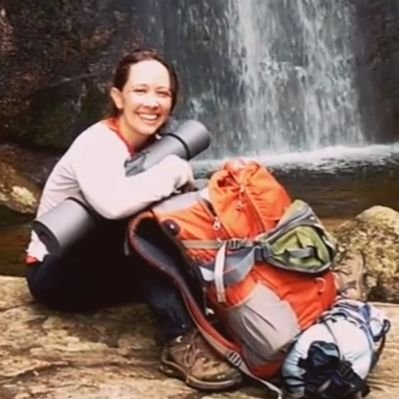
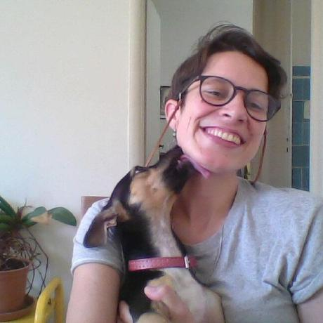


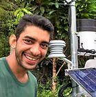

```
]

.right-column[
#### Scientific Computation Laboratory - Rio de Janeiro Botanical Garden
#### ¡liibre! Independent Biodiversity Informatics Laboratory


+ Scientific workflows based in R for data downloading and cleaning, taxonomic checking
+ Biodiversity informatics, ENM/SDM, open science, reproducibility
+ Support for data-intensive research projects (e.g., CNCFlora - IUCN authority)
]

---

### Ecological niche modeling or species distribution modeling (ENM, SDM)

+ __Stastistical learning__ applied to the prediction of areas potentially suitable for the presence of a species
--
  + Species occurrence data (collection data bases, GBIF)
--
  + Environmental predictor variables  (Worldclim, remote sensing)
--

  + Diferent algorithms (GLM, SVM, random forests, classification trees, GBM)
--

  + Model performance (data partition into training and test data + performance metrics)
--


+ Early implementations: hidden code ("black boxes"), point-and-click applications

---
background-image: url("https://www.r-project.org/Rlogo.png")
background-position: 4% 4%
background-size: 200px

<br>
<br>
<br>
<br>

- Statistical programming language
--

- Libre software, open code, _lingua franca_ in Ecology
--

- Several options for ENM/SDM in R
--

  - GIS with __raster__, __sp__, __maps__, __rgdal__, __sf__
--

  - Established packages such as __dismo__ (Hijmans et al 2017), __BIOMOD2__ (Thuiller et al 2007)
--

  - Recent packages: **ENMeval** (Muscarella et al 2014), **sdm** (Naimi & Araujo 2016), **spThin** (Aiello-Lammens et al 2015), **zoon** (Golding et al. 2018), **wallace** (Kass et al 2018), **kuenm** (Cobos et al 2019), **occCite** (Lowens 2020)
--

#### Difficulties with scalability, code repetition, decision documentation... .purple[non-reproducible]

---
background-image: url("https://the-turing-way.netlify.app/_static/logo.jpg")
background-position: 4% 4%
background-size: 200px
class: middle

+ [Open research](https://the-turing-way.netlify.app/reproducible-research/open.html): reproducible, transparent, reusable, collaborative, accountable, accessible to society
+ [Reproducibility](https://the-turing-way.netlify.app/reproducible-research/reproducible-research.html):
data and code being available to fully rerun the analysis


---
background-image: url("figs/modleR.png")
background-position: 4% 4%
background-size: 150px

<br>
<br>
<br>
<br>
<br>


A .purple[workflow] developed to __integrate and automatize__ some of the common steps in ecological niche modeling
--

- a four-step workflow:
--

  + `setup_sdmdata()`: data setup, cleaning, partition, pseudoabsence selection
--

  + `do_any()` and `do_many()`: model fitting, projecting and evaluating
--

  + `final_model()`: joining partitions
--

  + `ensemble_model()`: algorithm consensus

---
background-image: url("figs/modleR.png")
background-position: 4% 4%
background-size: 150px

.right[
## a four-step workflow


```{r, out.width=1000, fig.alt="Workflow scheme. The first step cleans and partitions data into training and test sets, samples pseudoabsences and controls for the correlation of explanatory variables. The second step fits an algorithm per partition, for each train and test set. The third step joins partitions, creating a model per algorithm. The fourth step analyzes algorithm consensus -'ensemble modeling', to obtain a unique model per species"}
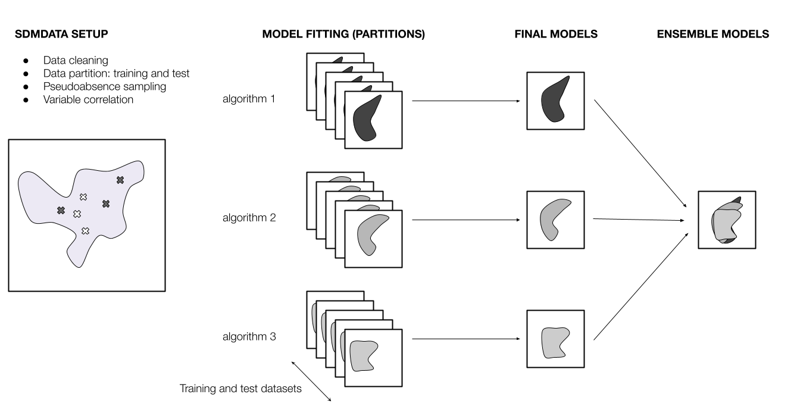
```
]

---
## 1. `setup_sdmdata()`: data preparation

Data preparation and cleaning should be performed previously

+ Data cleaning: exact duplicates, NAs and one occurrence per pixel
+ Experimental design: bootstrap, cross-validation
+ Pseudo-absence sampling
+ Control of variable correlation up to a user-defined value (e.g., 0.8)

---
## pseudoabsence sampling

```{r, out.width=800, fig.align="center"}
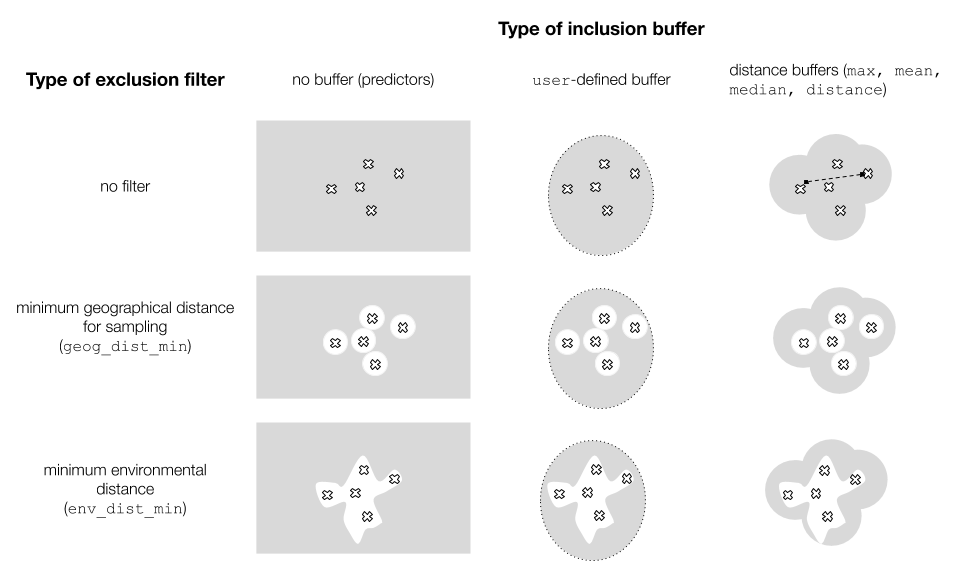
```

---
## 2. `do_(m)any()`: model fitting and projection

+ `do_any()` for one algorithm and partition (ex. `algo = "maxent"`)
+ `do_many()` calls `do_any()` to fit multiple algorithms (ex: `bioclim = TRUE`, `maxent = TRUE`)
+ Parametrization
- Algoritmos: dismo, maxnet, GLM, SVM, bosques aleatorios, boosted regression trees (BRT)
+ Projection to different datasets (in time or space)
+ Returns table with performance statistics -> TSS, AUC, pROC, FNR, Jaccard...

---
## 2. `do_(m)any()`: model fitting and projection

```{r, out.width=300}
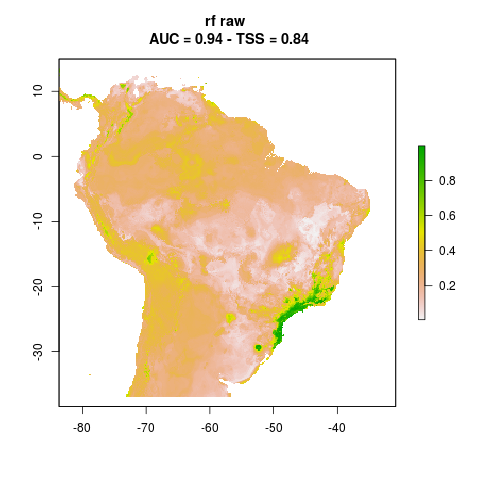
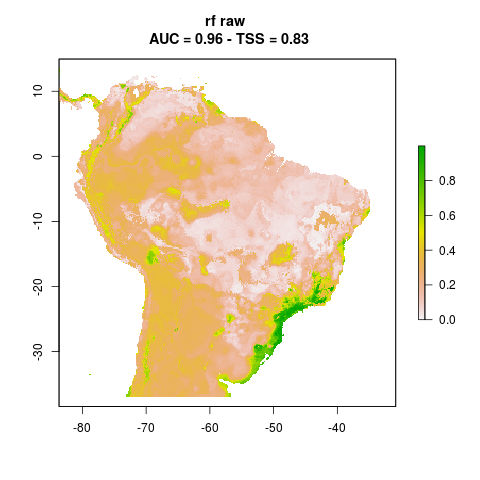
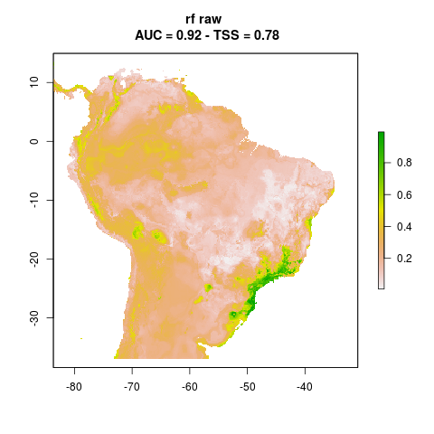
```

_Abarema langsdorffii_, three partitions, randomForests

---
## 3. `final_model()`: a model per algorithm per species

+ The basics: a central tendency measure and uncertainty between partitions
+ Which models to join? (the raw continuous model, the binary)
+ Some additional operations: consensus between binary models
+ Uncertainty: range (max - min) between partitions

---
## 3. `final_model()`: a model per algorithm per species

.center[
```{r, out.width=400}
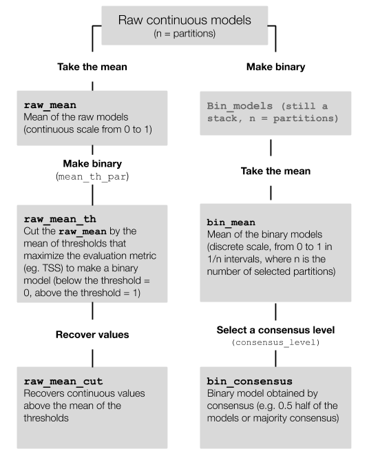
```
]

---
## 3. `final_model()`: a model per algorithm per species

```{r, out.width=300}
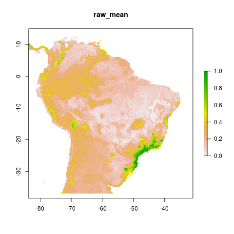
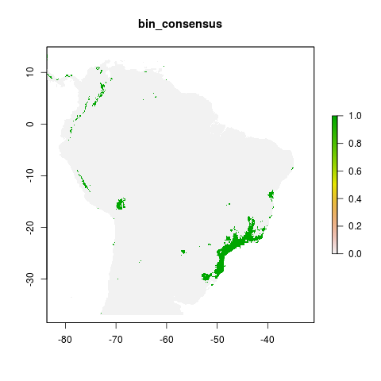
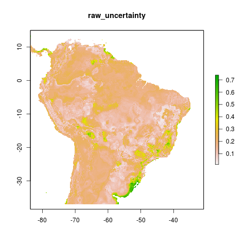
```

Raw mean
Binary consensus
Uncertainty (range)

---
## 4. `ensemble_model()` - algorithmic consensus

+ Mean between final models
+ Consensus
+ Best-performing algorithm
+ PCA between algorithms
+ Range uncertainty metrics
+ Ensemble models do not necessarily perform better than individual algorithms (Zhu & Peterson 2017)
+ Evaluate different ensemble model performance (WIP)


---
## folder structure and portability

.pull-left[
+ A single working directory per project
+ Different steps: different subfolders
+ A consistent subfolder structure
+ Relative rather than absolute paths and no `setwd()`
]

.pull-right[
```{r}
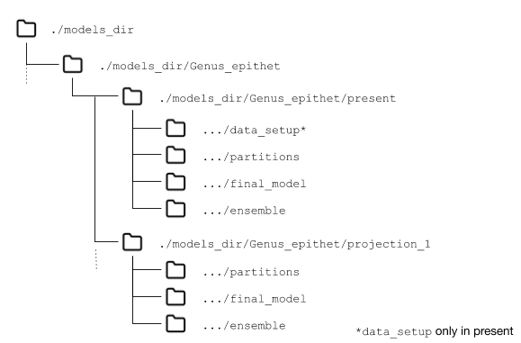
```
]

---
## modularity

+ Each step saves its output
+ The next step reads the previous output
+ Using HD space rather than RAM
+ The user may enter and exit the workflow at any step
+ Parallelization and use in high performance/high throughput computational frameworks (HPC/HTC)

```{r}
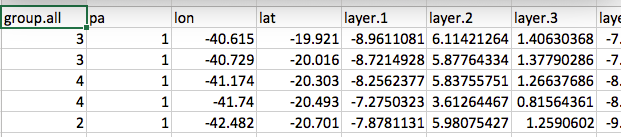
```

---
## reproducibility

```{r, out.width=600}
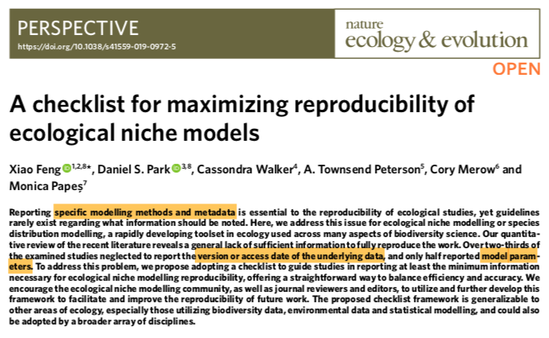
```

---
## thorough metadata recording

+ metadata: parametrization options
+ session information
+ environment: packages used and their version


```{r, out.width=600}
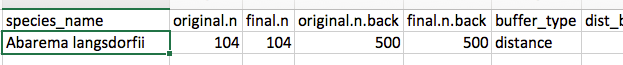
```

---
## interoperability

We did not create new classes or methods: communication with other packages in the R environment

```{r, , fig.alt="xkcd comic: title: how standards proliferate: (see a/c chargers, chracater encodings, instant messaging, etc) First frame: Situation: There are 14 competing standards. Second frame: two human figures. Person 1: '14?! Ridiculous! We need to develop one universal standard that covers everyone's use cases'. Person 2: 'Yeah!'. Third frame: Soon: Situation: There are 15 competing standards."}
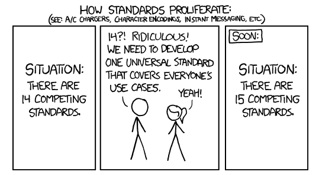
```

---
## final remarks

+ Reproducibility should drive any ENM workflow
+ Metadata are really useful - and necessary
+ Any ENM workflow should be easily adapted to HPC
+ Flexibility to start and leave at any step is essential to guarantee a solid evaluation of ENMs
+ It is not a problem to have one more package if it integrates with other packages

---
## final remarks

+ Invest in:
  + learning script-based applications (programming)
  + version control (git)
+ Use tools for environment reproducibility (__Renv__ package, Docker containers)
