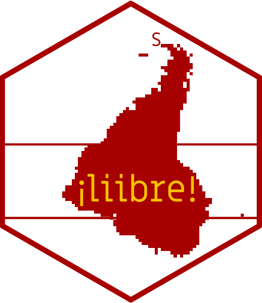
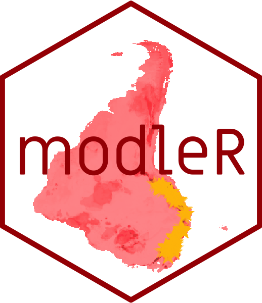
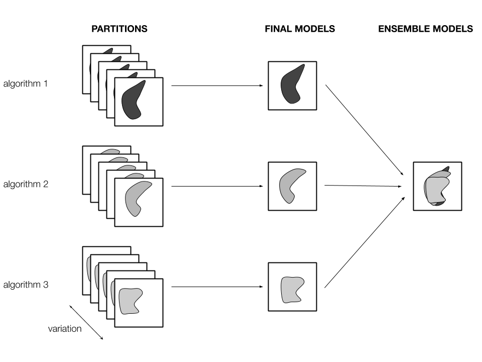
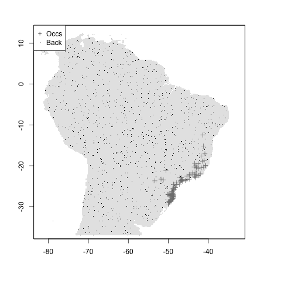
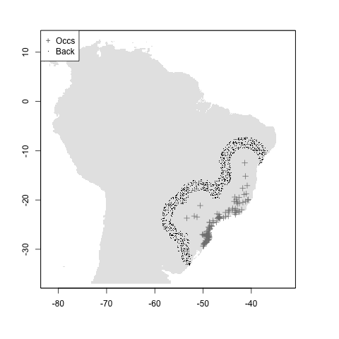
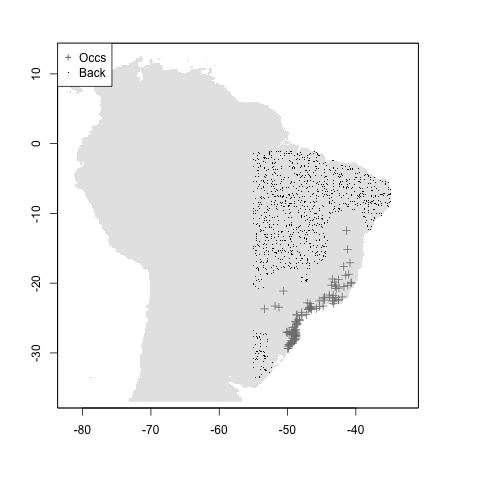

class: middle

```{r setup, include=FALSE}
options(htmltools.dir.version = FALSE)
options(servr.daemon = TRUE)#para que no bloquee la sesión
knitr::opts_chunk$set(echo = FALSE)
```

```{r xaringan-themer, include=FALSE, warning=FALSE}
library(xaringanthemer)
style_duo_accent(
  primary_color = "#181818",
  secondary_color = "#A70000",
  colors = c(
    red = "#A70000",
    purple = "#88398a",
    orange = "#ff8811",
    green = "#136f63",
    blue = "#4B4FFF",
    white = "#FFFFFF",
    black = "#181818"
  ),
  text_bold_color = "#181818",
  code_font_google = google_font("Fira Mono"), text_font_size = "24px"
)
```

```{r xaringan-logo, echo=FALSE}
library(xaringanExtra)
use_logo(
  image_url = "figs/logo.png",
  width = "300px",
  position = css_position(bottom = "1em", left = "88%"),
)
```

```{css, echo = F}
.remark-slide-number {
  display: none;
}

```

<br>
<br>
<center>
## Creating open, reproducible workflows for ecological niche modeling

### Andrea Sánchez-Tapia, Sara Ribeiro Mortara, Felipe Sodré Barros
</center>
<br>
<br>


```{r, out.width= 150}

```

---
background-image: url("figs/logo_jbrj.png")
background-position: 98% 2%
background-size: 100px
.left-column[
```{r, out.width= 90, fig.align="left", fig.alt="Pictures of the team: Andrea Sánchez-Tapia, Sara Mortara, Felipe Sodré Barros, Guilherme Gall, Diogo Rocha, and Marinez Ferreira de Siqueira (PI)"}
knitr::include_graphics("figs/andrea.jpg")
knitr::include_graphics("figs/SRM.jpg")
knitr::include_graphics("figs/Felipe_Barros.jpg")
knitr::include_graphics("figs/gui.jpeg")
knitr::include_graphics("figs/diogo.jpeg")
knitr::include_graphics("figs/mari.jpeg")
```
]

.right-column[ 
.left[ #### Scientific Computation Laboratory - Rio de Janeiro Botanical Garden]
#### ¡liibre! Independent Biodiversity Informatics Laboratory


+ Biodiversity informatics, ENM/SDM, open science, reproducibility
+ Scientific workflows based in R for data downloading and cleaning, taxonomic checking
+ Support for data-intensive research projects (e.g., CNCFlora - IUCN authority)
]


---


Reproducibility: 
"data and code being available to fully rerun the analysis" -- _The Turing Way_

---
+ Version control

+ Reproducible computational environments:
lotos of levels: package version awareness, controllers: Renv, containers: Docker

---
### why build an ENM package?

+ Usabilidad 
+ Calidad 
+ Estilo
+ Documentación
+ Qué gap llena?
+ En qué mejora flujos previos?

necesitábamos un flujo de trabajo

---
## why building an ENM package?

We started with a __project-specific__ set of scripts to execute ENM for species in the Brazilian Atlantic Forest 
<!-- specific question, specific scripts -->
Other projects: similar structure but flexibility needed depending on the __research question__

Many options within R:

- GIS with __raster__, __sp__, __maps__, __rgdal__, __sf__
- Established packages such as __dismo__ (Hijmans et al 2017), __BIOMOD2__ (Thuiller et al 2007)
- Other packages
  + occCite (Lowens 2020)
  + ENMeval (Muscarella et al 2014),
  + sdm (Naimi \& Araújo 2016),
  + spThin (Aiello‐Lammens et al 2015),
  + zoon (Golding et al. 2018),
  + wallace (Kass et al 2018),
  + kuenm (Cobos et al. 2019),

---
## folder structure and portability

.pull-left[
+ A single working directory per project
+ Different steps: different subfolders
+ A consistent subfolder structure
+ Relative rather than absolute paths and no `setwd()`
]

.pull-right[ 
```{r}
knitr::include_graphics("figs/fig03_folder.png")
```
]

---
## modularity
+ Each step saves its output
+ The next step reads the previous output
+ Using HD space rather than RAM
+ The user may enter and exit the workflow at any step
+ Parallelization and use in high performance/high throughput computational frameworks (HPC/HTC)

---
## reproducibility

```{r, out.width=600}
knitr::include_graphics("figs/feng.png")
```

---
## thorough metadata recording:
+ parametrization options
+ session information
+ packages used and their version
  
---
## interoperability

We did not create new classes or methods: communication with other packages in the R environment
    
```{r}
knitr::include_graphics("figs/xkcd_standards.png")
```

---
## modleR

A workflow developed to automatize some of the common steps in ecological niche modeling
  
```{r, out.width=150}

```

---
## a four-step workflow
+ `setup_sdmdata()`: data setup
+ `do_any()` and `do_many()`: model fitting, projecting and evaluating
+ `final_model()`: joining partitions
+ `ensemble_model()`: algorithm consensus

---
## a four-step workflow

.center[
```{r, out.width=600}

```
]

---
## a four-step workflow

```{r, out.width=600}
knitr::include_graphics("figs/fig01_workflow.jpg")
```


---
## Step 1 `setup_sdmdata()`: data preparation

Data preparation and cleaning should be performed previously
+ Optional data cleaning checks: exact duplicates, NAs and one occurrence per pixel
+ Experimental design: bootstrap, cross-validation
+ Pseudo-absence sampling
+ Control of variable correlation up to a user-defined value (e.g., 0.8)

---
## pseudoabsence sampling

```{r, out.width=600}
knitr::include_graphics("figs/fig04_buffer.png")
```

---
## pseudoabsence sampling

```{r, out.width = 200}



```
+ no buffer
+ mean distance buffer and euclidean distance filter
+ user-defined buffer (M) and euclidean distance filter


---
## `setup_sdmdata()` output
At the end of data setup:

+ metadata and session information
+ a data frame `sdmdata.csv` that will be used in the next step

```{r, out.width=600}
knitr::include_graphics("figs/sdmdata_table.png")
knitr::include_graphics("figs/metadata.png")
```

---
## Step 2. `do_(m)any()`: model fitting and projection

```{r, out.width=600}
knitr::include_graphics("figs/fig01_workflow.jpg")
```

---
##  `do_(m)any()`: model fitting and projection

+ `do_any()` for one algorithm and partition (ex. `algo = "maxent"`)
+ `do_many()` calls `do_any()` to fit multiple algorithms (ex: `bioclim = TRUE`, `maxent = TRUE`)
+ Parametrization
+ The user can apply a mask
+ Projection to different datasets (in time or space)
+ Returns table with performance statistics -> TSS, AUC, pROC, FNR, Jaccard...

---
## `do_(m)any()`: model fitting and projection

Current algorithms:

+ bioclim, mahalanobis distance, maxent from dismo package
+ Boosted regression trees (BRT) as implemented by `gbm.step()` function in __dismo__ package
+ maxent from __maxnet__ package
+ GLM from base R, implemented with a stepwise selection approach
+ Support Vector Machines (SVM), from packages __kernlab__ and __e1071__
+ Random Forests from package __randomForest__

---
## `do_(m)any()` output
At the end of the model fitting stage:

+ Outputs in the hard disk: .tif, .png for each partition
+ Evaluation data frames with the performance statistics at different thresholds
+ Metadata and session information

---
## `do_(m)any()` output (one fit model per partition)

```{r, out.width=300}
knitr::include_graphics("figs/modleR/rf_cont_Abarema_langsdorffii_1_1.png")
knitr::include_graphics("figs/modleR/rf_cont_Abarema_langsdorffii_1_2.png")
knitr::include_graphics("figs/modleR/rf_cont_Abarema_langsdorffii_1_3.png")
```

_Abarema langsdorffii_, three partitions, randomForests

---
## Step 3. `final_model()`: a model per algorithm per species
    
```{r, out.width=600}
knitr::include_graphics("figs/fig01_workflow.jpg")
```

---
## `final_model()`: a model per algorithm per species

+ The basics: a central tendency measure and uncertainty between partitions
+ Which models to join? (the raw continuous model, the binary)
+ Some additional operations: consensus between binary models
      %\subitem - buscar um limiar médio e recuperar o binário e o contínuo a partir dele \\
      %\subitem - extrair o consenso entre os binários \\
+ Uncertainty: range (max - min) between partitions

---
## `final_model()`: a model per algorithm per species

```{r, out.width=600}
knitr::include_graphics("figs/fig05_finalmodel.png")
```

---
## `final_model()`: a model per algorithm per species

```{r, out.width=300}
knitr::include_graphics("figs/modleR/Abarema_langsdorffii_rf_raw_mean.png")
knitr::include_graphics("figs/modleR/Abarema_langsdorffii_rf_bin_consensus.png")
knitr::include_graphics("figs/modleR/Abarema_langsdorffii_rf_raw_uncertainty.png")
```

Raw mean
Binary consensus
Uncertainty (range)

---
## Step 4. `ensemble_model()` - algorithmic consensus

figs/fig01_workflow.pdf

---
## `ensemble_model()`: algorithmic consensus

+ Mean between final models
+ Consensus
+ Best-performing algorithm
+ PCA between algorithms
+ Range uncertainty metrics
+ Ensemble models do not necessarily perform better than individual algorithms (Zhu & Peterson 2017)
+ Evaluate different ensemble model performance (WIP)

---

## Installing and using modleR
figs/pkgdown.png

---
## other resources
## projections https://model-r.github.io/modleR/articles/articles/projection.html

figs/modleR/vignette_projection.png

---
## final remarks

+ Reproducibility should drive any ENM workflow
+ Metadata are really useful - and necessary
+ Any ENM workflow should be easily adapted to HPC
+ Flexibility to start and leave at any step is essential to guarantee a solid evaluation of ENMs 
+ decisions and evaluation based on theoretical assumptions
+ It is not a problem to have one more package if it integrates with other packages

figs/biorxiv.png
figs/preprint.png
