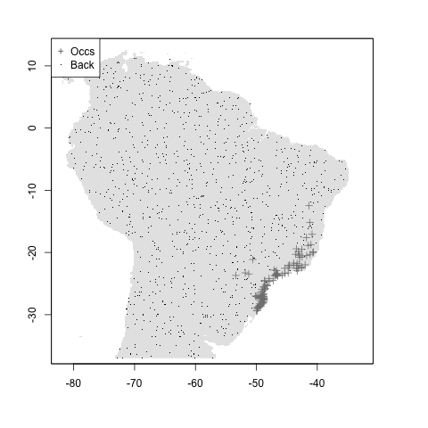
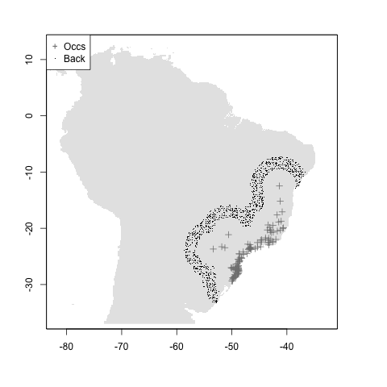
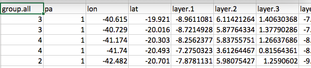
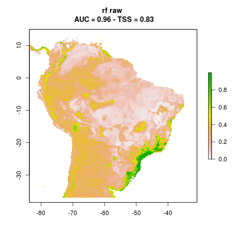
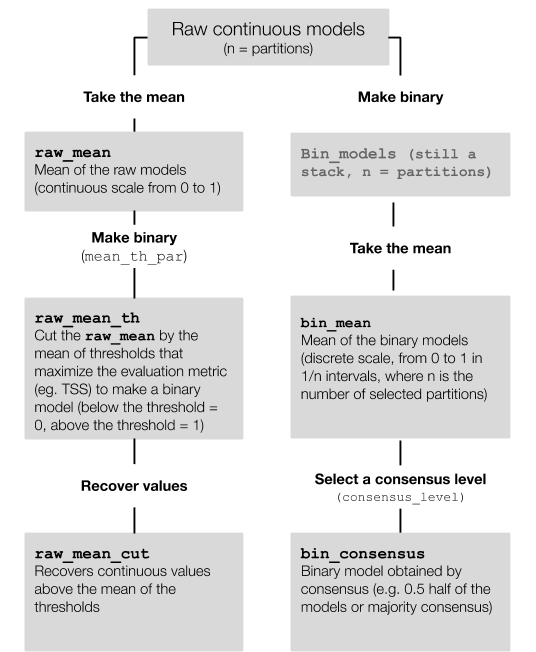
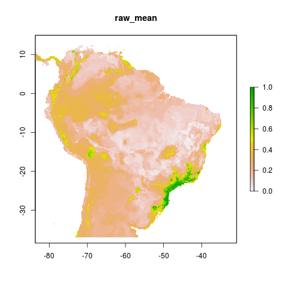

class: middle

```{r setup, include=FALSE}
options(htmltools.dir.version = FALSE)
options(servr.daemon = TRUE)#para que no bloquee la sesión
knitr::opts_chunk$set(echo = FALSE)
```

```{r xaringan-themer, include=FALSE, warning=FALSE}
library(xaringanthemer)
style_duo_accent(
  primary_color = "#181818",
  secondary_color = "#A70000",
  colors = c(
    red = "#A70000",
    purple = "#88398a",
    orange = "#ff8811",
    green = "#136f63",
    blue = "#4B4FFF",
    white = "#FFFFFF",
    black = "#181818"
  ),
  text_bold_color = "#181818",
  code_font_google = google_font("Fira Mono"), text_font_size = "24px"
)
```

```{r xaringan-logo, echo=FALSE}
library(xaringanExtra)
use_logo(
  image_url = "figs/logo.png",
  width = "300px",
  position = css_position(bottom = "1em", left = "88%"),
)
```

```{css, echo = F}
.remark-slide-number {
  display: none;
}
```

<br>
<br>
<center>
## Creando flujos de trabajo abiertos y reproducibles para el modelamiento de nichos ecológicos

### Andrea Sánchez-Tapia, Sara Ribeiro Mortara, Felipe Sodré Barros
</center>
<br>
<br>


```{r, out.width= 150}
knitr::include_graphics("figs/logo_liibre.png")
```

---
background-image: url("figs/logo_jbrj.png")
background-position: 98% 2%
background-size: 100px
.left-column[
```{r, out.width= 90, fig.align="left", fig.alt="fotos del equipo: Andrea Sánchez-Tapia, Sara Mortara, Felipe Sodré Barros, Guilherme Gall, Diogo Rocha, y Marinez Ferreira de Siqueira (Investigadora principal)"}
knitr::include_graphics("figs/andrea.jpg")
knitr::include_graphics("figs/SRM.jpg")
knitr::include_graphics("figs/Felipe_Barros.jpg")
knitr::include_graphics("figs/gui.jpeg")
knitr::include_graphics("figs/diogo.jpeg")
knitr::include_graphics("figs/mari.jpeg")
```
]

.right-column[
.left[ #### Laboratorio de computación científica y geoprocesamiento del Jardín Botánico de Río de Janeiro]
#### ¡liibre! Laboratorio Independiente de Informática de la Biodiversidad y Reproducibilidad en Ecología


+ Informática de la biodiversidad, MNE, ciencia abierta, reproducibilidad
+ Flujos de trabajo científicos basados en R para descarga y limpieza de datos, verificación taxonómica
+ Soporte a proyectos de investigación que utilizan informática de la biodiversidad (e.g., CNCFlora - autoridad UICN para la Flora de Brasil)
]


---

Reproducibility:
"data and code being available to fully rerun the analysis" -- _The Turing Way_

---

+ Version control
+ Reproducible computational environments:
many levels: package version awareness, controllers: Renv, containers: Docker

---
## why build an ENM package?

+ Usabilidad
+ Calidad
+ Estilo
+ Documentación
+ Qué gap llena?
+ En qué mejora flujos previos?

necesitábamos un flujo de trabajo

---
## ¿por qué crear un paquete de MNE?

- Comenzamos con un conjunto de scripts de específico del proyecto para ejecutar MNE para especies en el Bosque Atlántico brasileño
- Otros proyectos: estructura similar pero flexibilidad necesaria según la pregunta de investigación
- Varias opciones dentro de R

  - SIG con __raster__, __sp__, __maps__, __rgdal__, __sf__
  - Paquetes reconocidos como __dismo__ (Hijmans et al 2017), __BIOMOD2__ (Thuiller et al 2007)
  - Otros paquetes: **ENMeval** (Muscarella et al 2014), **sdm** (Naimi & Araujo 2016), **spThin** (Aiello-Lammens et al 2015), **zoon** (Golding et al. 2018), **wallace** (Kass et al 2018), **kuenm** (Cobos et al 2019), **occCite** (Lowens 2020)


__Necesitábamos un flujo de trabajo en lugar de paquetes de R independientes__

---
## estructura de carpetas y portabilidad

.pull-left[
- Un único directorio de trabajo por proyecto
- Diferentes pasos: diferentes subcarpetas
- Una estructura de subcarpetas consistente
- Rutas relativas en lugar de absolutas y no `setwd()`
]

.pull-right[
```{r}
knitr::include_graphics("figs/fig03_folder.png")
```
]

---
## modularidad

- Cada paso guarda su salida
- El siguiente paso lee la salida anterior
- Usando espacio en disco en lugar de RAM
- Se puede entrar y salir del flujo de trabajo en cualquier paso
- Paralelización y uso en marcos computacionales de alto procesamiento / alto rendimiento (HPC / HTC)

---
## reproducibilidad

```{r, out.width=600}
knitr::include_graphics("figs/feng.png")
```

---
## registro detallado de metadatos

 - opciones de parametrización
 - información de sesión
 - paquetes utilizados y su versión

---
## interoperabilidad

No creamos nuevas clases o métodos: comunicación con otros paquetes de R

```{r, fig.alt="cómic de xkcd: título: ¿cómo proliferan los estándares? subtítulo: (ver: cargadores de corriente alternativa A/C, codificación de caracteres, mensajería instantánea, etc.) Primer cuadro: Situación: Hay 14 estándares compitiendo. Segundo cuadro: dos figuras humanas. Persona 1: '¿14? ¡Ridículo! Necesitamos desarrollar un estándar universal que cubra todos los casos de uso' Persona 2: '¡sí!'. Tercer cuadro: Pronto: Situación: Hay 15 estándares compitiendo"}
knitr::include_graphics("figs/xkcd_standards.png")
```

---
## modleR

Un flujo de trabajo desarrollado para automatizar algunos de los pasos comunes en el modelamiento de nichos ecológicos

```{r, out.width=150}
knitr::include_graphics("figs/modleR.png")
```

---
## un flujo de trabajo en cuatro pasos

+ `setup_sdmdata()`: configuración de datos, limpieza, partición, selección de pseudoausencias
+ `do_any()` and `do_many()`: ajuste, proyección y evaluación del modelo
+ `final_model()`: uniendo particiones
+ `ensemble_model()`: consenso entre algoritmos

---
## un flujo de trabajo en cuatro pasos

.center[
```{r, out.width=1000, fig.alt="Esquema del flujo de trabajo. el primer paso limpia y particiona los datos en conjunto de entrenamiento y test, muestrea pseudoausencias y controla la correlación de las variables explicativas. En el segundo paso cada algoritmo genera un modelo por partición, con variación entre ellas debido a la diferencia en los conjuntos de entrenamiento y test. En el tercer paso final_model() junta esas particiones de diferentes maneras, generando un modelo por algoritmo. El cuarto paso analiza el consenso entre algoritmos, en el paso que denominamos 'ensemble modeling', para obtener un único modelo por especie"}
knitr::include_graphics("figs/WORKFLOW.png")
```
]

---
## paso 1 `setup_sdmdata()`: preparación de datos

Preparación y limpieza de datos debe realizarse previamente

- Comprobaciones de limpieza de datos opcionales: datos duplicados, NA y una ocurrencia por píxel
- Diseño experimental: *bootstrap*, validación cruzada
- Muestreo de pseudo-ausencia
- Control de correlación de variables hasta un valor definido por el usuario (p. ej., 0,8)

---
## muestreo de pseudo-ausencias

```{r, out.width=800, fig.align="center"}
knitr::include_graphics("figs/fig04_buffer.png")
```

---
## muestreo de pseudo-ausencias

```{r, out.width = 200}


knitr::include_graphics("figs/buffer/usr_shape_and_mindist.png")
```

+ sin búfer
+ búfer de distancia media y filtro de distancia euclidiana
+ búfer definido por le usuarie (M) y filtro de distancia euclidiana


---
## `setup_sdmdata()` output

Al final de la configuración de datos:

- metadatos e información de sesión
- crea data.frame sdmdata.csv que se utilizará en el siguiente paso


```{r, out.width=600}

knitr::include_graphics("figs/metadata.png")
```

---
## paso 2. `do_(m)any()`: ajuste y proyección del modelo

- `do_any()` para un algoritmo y partición (ej. `algo = "maxent"`)
- `do_many()` llama a `do_any()` para ajustar múltiples algoritmos (ej. `bioclim = TRUE`, `maxent = TRUE`)
- Parametrización
- Se puede aplicar una máscara definida por le usuarie
- Proyección a diferentes conjuntos de datos (en el tiempo o el espacio)
- Devuelve una tabla con estadísticas de desempeño --> TSS, AUC, pROC, FNR, Jaccard

---
## `do_(m)any()`: model fitting and projection

Algoritmos actuales:

- bioclim, mahalanobis distance, maxent en el paquete **dismo**
- Boosted Regression Trees(BRT) implementados por la función `gbm.step()` del paquete **dismo**
- maxent del paquete **maxnet**
- GLM de base R, implementado con un enfoque de selección paso a paso
- Support Vector Machines (SVM) de los paquetes **kernlab** y **e1071**
- Random Forest del paquete **randomForest**

---
## salida de `do_(m)any()`

Al final de la etapa de ajuste del modelo:

- Salidas en el disco duro: .tif, .png para cada partición
- data.frame de evaluación con las estadísticas de desempeño en diferentes umbrales
- Metadatos e información de sesión

---
## salida de `do_(m)any()` (un modelo ajustado por partición)

```{r, out.width=300}
knitr::include_graphics("figs/modleR/rf_cont_Abarema_langsdorffii_1_1.png")

knitr::include_graphics("figs/modleR/rf_cont_Abarema_langsdorffii_1_3.png")
```

_Abarema langsdorffii_, tres particiones, bosques aleatorios

---
## paso 3. `final_model()`: un modelo por algoritmo por especie

- lo básico: una medida de tendencia central e incertidumbre entre particiones
- ¿qué modelos unir? (el modelo continuo sin procesar, el binario)
- algunas operaciones adicionales: consenso entre modelos binarios
- incertidumbre: rango (max-min) entre particiones

---
## paso 3. `final_model()`: un modelo por algoritmo por especie


.center[
```{r, out.width=400}

```
]

---
## paso 3. `final_model()`: un modelo por algoritmo por especie


```{r, out.width=300}

knitr::include_graphics("figs/modleR/Abarema_langsdorffii_rf_bin_consensus.png")
knitr::include_graphics("figs/modleR/Abarema_langsdorffii_rf_raw_uncertainty.png")
```

Media de los modelos brutos
Consenso de los modelos binarios
Incertidumbre (rango)

---
## paso 4. `ensemble_model()` - consenso entre algoritmos

- Media entre `final_models()`
- Consenso
- Algoritmo de mejor desempeño
- PCA entre algoritmos
- Métricas de incertidumbre
- Los modelos *ensemble* no necesariamente funcionan mejor que los algoritmos individuales (Zhu & Peterson 2017)
+ Evaluar el desempeño de diferentes métodos de consenso (WIP)

---
## final remarks

- La reproducibilidad debería impulsar cualquier flujo de trabalho de MNE
- Los metadatos son realmente útiles y necesarios
- Cualquier flujo de trabajo MNE debe adaptarse fácilmente a HPC
- La flexibilidad para empezar y salir en cualquier paso es fundamental para garantir una evaluación sólida de los ENM
 - No es un problema tener un paquete más si se integra con otros paquetes
