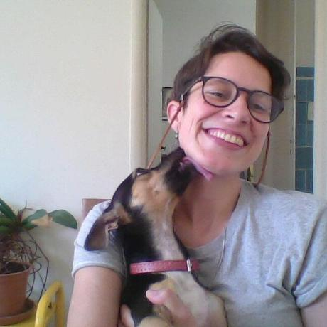
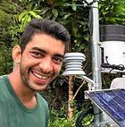
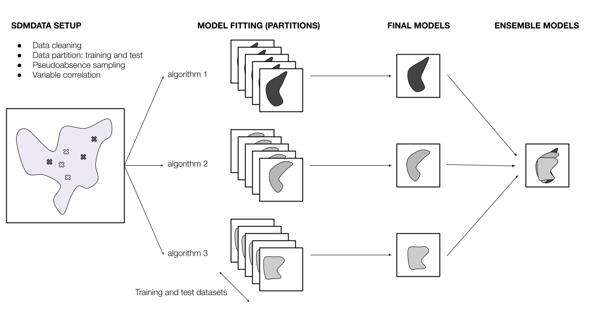
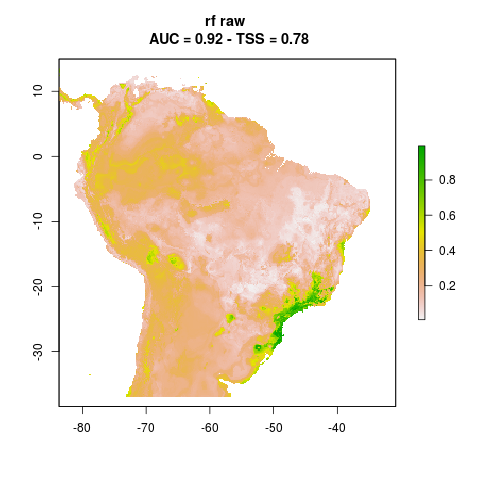
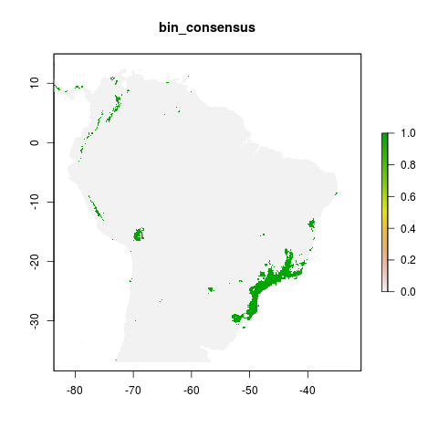
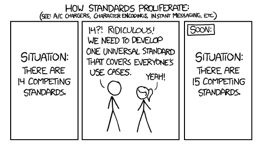
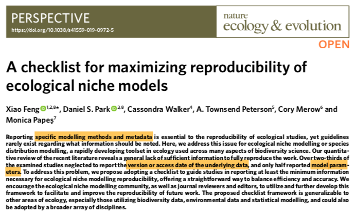

class: middle

```{r setup, include=FALSE}
options(htmltools.dir.version = FALSE)
options(servr.daemon = TRUE)#para que no bloquee la sesión
knitr::opts_chunk$set(echo = FALSE)
```

```{r xaringan-themer, include=FALSE, warning=FALSE}
library(xaringanthemer)
style_duo_accent(
  primary_color = "#181818",
  secondary_color = "#88398a",
  colors = c(
    red = "#A70000",
    purple = "#88398a",
    orange = "#ff8811",
    green = "#136f63",
    blue = "#4B4FFF",
    white = "#FFFFFF",
    black = "#181818"
  ),
  text_bold_color = "#181818",
  code_font_google = google_font("Fira Mono"),
  text_font_size = "24px",
  code_font_size = "0.8rem"

)
```

```{r xaringan-logo, echo=FALSE}
library(xaringanExtra)
use_logo(
  image_url = "figs/logo.png",
  width = "300px",
  position = css_position(bottom = "1em", left = "88%"),
)
```

```{css, echo = F}
.remark-slide-number {
  display: none;
}
```

<br>
<br>
<center>

# Creando flujos de trabajo abiertos y reproducibles para el modelamiento de nichos ecológicos

### Andrea Sánchez-Tapia, Sara Ribeiro Mortara, Felipe Sodré Barros

### FOSS4G Buenos Aires 2021
</center>
<br>


__[Slides in English](https://andreasancheztapia.github.io/FOSS4G_2021/english#1)__


---
background-image: url("figs/logo_jbrj.png")
background-position: 98% 2%
background-size: 100px
.left-column[
```{r, out.width= 90, fig.align="left", fig.alt="fotos del equipo: Andrea Sánchez-Tapia, Sara Mortara, Felipe Sodré Barros, Guilherme Gall, Diogo Rocha, y Marinez Ferreira de Siqueira (Investigadora principal)"}
knitr::include_graphics("figs/andrea.jpg")

knitr::include_graphics("figs/Felipe_Barros.jpg")
knitr::include_graphics("figs/gui.jpeg")

knitr::include_graphics("figs/mari.jpeg")
```
]

.right-column[
#### Núcleo de Computación Científica y Geoprocesamiento - Jardín Botánico de Río de Janeiro
#### ¡liibre! Laboratorio Independiente de Informática de la Biodiversidad y Reproducibilidad en Ecología


+ Flujos de trabajo científicos basados en R para descarga y limpieza de datos, verificación taxonómica
+ Informática de la biodiversidad, MNE, ciencia abierta, reproducibilidad
+ Soporte a proyectos de investigación que utilizan datos sobre biodiversidad (e.g., CNCFlora - autoridad UICN para la Flora de Brasil)
]

---
background-image: url("https://the-turing-way.netlify.app/_static/logo.jpg")
background-position: 4% 4%
background-size: 200px


.right[
### https://the-turing-way.netlify.app/welcome
]

<br>
<br>
<br>
<br>
+ [Investigación abierta](https://the-turing-way.netlify.app/reproducible-research/open.html): reproducible, transparente, reutilizable, colaborativa, responsable, accesible a la sociedad
+ [Reproducibilidad](https://the-turing-way.netlify.app/reproducible-research/reproducible-research.html):
datos y código disponibles para volver a rodar los análisis

---
## modelos de nicho ecológico o de distribución potencial de especies (ENM, SDM)

+ __Aprendizaje estadístico__ aplicado a la preducción de áreas potencialmente adecuadas para la presencia de especies

--

  + Datos de ocurrencia de las especies (bases de dados de colecciones)

--

  + Variables predictoras ambientales (Worldclim, sensoriamiento remoto)

--

  + Diferentes algoritmos (GLM, SVM, Bosques aleatorios, árboles de clasificación, GBM)

--

  + Desempeño de modelos (partición de los datos en conjunto de entrenamiento y test + métricas de desempeño)

--

+ Primeras implementaciones: código oculto, uso interactivo con el ratón

---
background-image: url("https://www.r-project.org/Rlogo.png")
background-position: 4% 4%
background-size: 200px

<br>
<br>
<br>
<br>

- Lenguaje de programación en estadística
--

- Software libre, código abierto, _lingua franca_ en Ecología
--

- Varias opciones para ENM/SDM dentro de R
--

  - SIG con __raster__, __sp__, __maps__, __rgdal__, __sf__
--

  - Paquetes reconocidos como __dismo__ (Hijmans et al 2017), __BIOMOD2__ (Thuiller et al 2007)
--

  - Paquetes recientes: **ENMeval** (Muscarella et al 2014), **sdm** (Naimi & Araujo 2016), **spThin** (Aiello-Lammens et al 2015), **zoon** (Golding et al. 2018), **wallace** (Kass et al 2018), **kuenm** (Cobos et al 2019), **occCite** (Lowens 2020)
--

#### Dificultad con escalabilidad, repetición de código, documentación de decisiones... .purple[no reproducilibidad]


---
background-image: url("figs/modleR.png")
background-position: 4% 4%
background-size: 150px

<br>
<br>
<br>
<br>
<br>

- https://model-r.github.io/modleR/index.html
--

- Un .purple[flujo de trabajo] desarrollado para __integrar y automatizar__ algunos de los pasos comunes en el modelamiento de nichos ecológicos
--

- Cuatro pasos:
--

  + `setup_sdmdata()`: configuración de datos, limpieza, partición, selección de pseudoausencias
--

  + `do_any()` and `do_many()`: ajuste, proyección y evaluación del modelo
--

  + `final_model()`: uniendo particiones
--

  + `ensemble_model()`: consenso entre algoritmos

---
background-image: url("figs/modleR.png")
background-position: 4% 4%
background-size: 150px

.right[
## un flujo de trabajo en cuatro pasos

```{r, out.width=1000, fig.alt="Esquema del flujo de trabajo. el primer paso limpia y particiona los datos en conjunto de entrenamiento y test, muestrea pseudoausencias y controla la correlación de las variables explicativas. En el segundo paso cada algoritmo genera un modelo por partición, con variación entre ellas debido a la diferencia en los conjuntos de entrenamiento y test. En el tercer paso final_model() junta esas particiones de diferentes maneras, generando un modelo por algoritmo. El cuarto paso analiza el consenso entre algoritmos, en el paso que denominamos 'ensemble modeling', para obtener un único modelo por especie"}

```
]

---
## 1. `setup_sdmdata()`: preparación de datos


- Limpieza de datos: datos duplicados, NA y una ocurrencia por píxel (¡No excluye la necesidad de preparar y limpiar datos previamente!)

--

- Diseño experimental: *bootstrap*, validación cruzada

--

- Muestreo de pseudo-ausencias

--

- Control de correlación de variables hasta un valor definido por el usuarie (p. ej., 0,8)

---
## 2. `do_(m)any()`: ajuste y proyección del modelo

- `do_any()` para un algoritmo y partición (ej. `algo = "maxent"`)

--

- `do_many()` llama a `do_any()` para ajustar múltiples algoritmos (ej. `bioclim = TRUE`, `maxent = TRUE`)

--

- Parametrización

--

- Algoritmos: dismo, maxnet, GLM, SVM, bosques aleatorios, boosted regression trees (BRT)

--

- Proyección a diferentes conjuntos de datos (en el tiempo o el espacio)

--

- Devuelve una tabla con estadísticas de desempeño `->` TSS, AUC, pROC, FNR, Jaccard


---
## 2. `do_(m)any()`: ajuste y proyección del modelo

```{r, out.width=300}
knitr::include_graphics("figs/modleR/rf_cont_Abarema_langsdorffii_1_1.png")
knitr::include_graphics("figs/modleR/rf_cont_Abarema_langsdorffii_1_2.png")

```

_Abarema langsdorffii_, tres particiones, bosques aleatorios

---
## 3. `final_model()`: un modelo por algoritmo por especie


- Lo básico: una medida de tendencia central e incertidumbre entre particiones

--

- ¿Qué modelos unir? (el modelo continuo sin procesar, el binario)

--

- Algunas operaciones adicionales: consenso entre modelos binarios

--

- Incertidumbre: rango (max-min) entre particiones

---
## 3. `final_model()`: un modelo por algoritmo por especie


```{r, out.width=300}
knitr::include_graphics("figs/modleR/Abarema_langsdorffii_rf_raw_mean.png")

knitr::include_graphics("figs/modleR/Abarema_langsdorffii_rf_raw_uncertainty.png")
```

1. Media de los modelos brutos
2. Consenso de los modelos binarios
3. Incertidumbre (rango)

---
## 4. `ensemble_model()` - consenso entre algoritmos

- Media entre `final_models()`

--

- Algoritmo de mejor desempeño

--

- PCA entre algoritmos

--

- Métricas de incertidumbre

--

- Los modelos *ensemble* no necesariamente funcionan mejor que los algoritmos individuales (Zhu & Peterson 2017)

--

+ Evaluar el desempeño de diferentes métodos de consenso (WIP)


---
class: center, middle

# modleR fue escrito para implementar buenas prácticas en computación científica

---
## estructura de carpetas y portabilidad

.pull-left[

- Un único directorio de trabajo por proyecto

- Una estructura de subcarpetas consistente.

- Diferentes pasos: diferentes subcarpetas

- Rutas relativas en lugar de absolutas y no `setwd()`
]

.pull-right[
```{r}
knitr::include_graphics("figs/fig03_folder.png")
```
]

---
## modularidad

- Cada paso guarda su salida

--

- El siguiente paso lee la salida anterior

--

- Usando espacio en disco en lugar de RAM:

--

  - Permite entrar y salir del flujo de trabajo en cualquier paso

--

  - Paralelización y uso en marcos computacionales de alto procesamiento / alto rendimiento (HPC / HTC)


---
## registro detallado de metadatos

- Opciones de parametrización

--

- Información de sesión

--

- Paquetes utilizados y su versión

--

```{r, out.width=600}
knitr::include_graphics("figs/metadata.png")
```

---
## interoperabilidad

No creamos nuevas clases o métodos: comunicación con otros paquetes de R

```{r, fig.alt="cómic de xkcd: título: ¿cómo proliferan los estándares? subtítulo: (ver: cargadores de corriente alternativa A/C, codificación de caracteres, mensajería instantánea, etc.) Primer cuadro: Situación: Hay 14 estándares compitiendo. Segundo cuadro: dos figuras humanas. Persona 1: '¿14? ¡Ridículo! Necesitamos desarrollar un estándar universal que cubra todos los casos de uso' Persona 2: '¡sí!'. Tercer cuadro: Pronto: Situación: Hay 15 estándares compitiendo"}

```

---
## reproducibilidad

```{r, out.width=600}

```

---
## consideraciones finales

- La reproducibilidad debería impulsar cualquier flujo de trabalho de MNE

--

- Los __metadatos__ son realmente útiles y necesarios

--

- __Escalabilidad__: un flujo adaptado para paralelización y alto desempeño

--

- La __flexibilidad__ para empezar y salir en cualquier paso es fundamental para garantizar la comunicación con otros paquetes y los requerimientos de cada proyecto

--

- Parte de un grupo mayor de paquetes de R en el área: esfuerzos de __integración__


---
class: middle, center

# ¡Gracias!


`r fontawesome::fa("twitter")` [@SanchezTapiaA](https://twitter.com/SanchezTapiaA)
`r fontawesome::fa("twitter")` [@MortaraSara](https://twitter.com/MortaraSara)
`r fontawesome::fa("twitter")` [@FelipeSMBarros](https://twitter.com/FelipeSMBarros)

`r fontawesome::fa("github")` [modleR](https://model-r.github.io/modleR/index.html)

